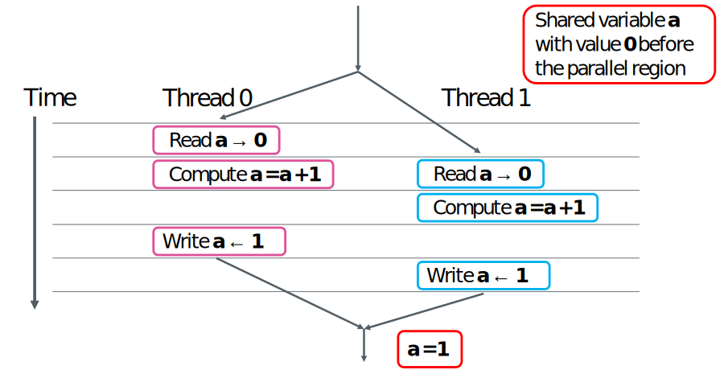

# OpenMP work-sharing constructs { .title-en }

CSC Training, 2017-08


---

# Work sharing
- Parallel region creates an “Single Program Multiple Data” instance where each thread executes the same code
- How can one split the work between the threads in a parallel region?
    - Loop construct
    - Single/Master construct
    - Sections construct
    - Task construct
    - Workshare construct (Fortran only)

---

# Loop construct

- Directive instructing compiler to share the work of a loop
- C/C++ (for-loops only):  **```#pragma omp for [clauses]```**
- Fortran: **```!$omp do [clauses]```**
    - The construct must followed by a loop construct
        - in C/C++ limited only to for-loops
    - It must reside inside a parallel region
    - Combined construct with ```omp parallel```: 
         - C/C++: **```#pragma omp parallel for```**
         - Fortran: **```!$omp parallel do```**
- The loop index is private by default
- Work sharing can be adjusted with the  schedule clause

---


# Loop construct
<div class="column">
### C/C++ 

```c
#pragma omp parallel shared(x,y,z) private(i)
{
#pragma omp for
   for (i=0; i < n ; i++)
      z[i] = x[i] + y[i]
}
```

### Fortran
```fortran
!$omp parallel shared(x,y,z) private(i)
!$omp do
  do i = 1, n
    z(i) = x(i) + y(i)
  end do
!$omp end do
!$omp end parallel

```

</div>

<div class="column">
In C/C++ only for-loops with a “canonical” form, such as here, can be used. Since OpenMP 3.0 one can also
use iterator based loops in C++ for random access containers (e.g. std::vector).
</div>


---

# Loop scheduling clause

<div class="column">
**```schedule(static[,chunk])```**

- Blocks of iterations of size chunk for each thread

**```schedule(dynamic[,chunk])```**

- Chunk iterations off a queue until everything is done

</div>

<div class="column">
**```schedule(guided[,chunk])```**

- Threads grab blocks of iterations, size of blocks starts from larger size and shrinks down to chunk

**```schedule(runtime)```**

- Schedule and chunk size are taken from environment variable ```OMP_SCHEDULE```

</div>

---

# Loop scheduling clause

### Fortran
```fortran
!$omp parallel shared(x,y,z) private(i)
!$omp do schedule(dynamic,chunk)
  do i = 1, n
    z(i) = x(i) + y(i)
  end do
!$omp end do
!$omp end parallel

```

### C/C++ 


```c
#pragma omp parallel shared(x,y,z) private(i)
{
#pragma omp for schedule(dynamic,chunk)
   for (i=0; i < n ; i++)
      z[i] = x[i] + y[i]
}
```


---

# Lastprivate data-sharing clause

**```lastprivate(list)```**

- Private variable where the original variable is updated with the value from the “last” parallel iteration step or section
- Variable can be both firstprivate and lastprivate

```c
int n = 10;
int a, b, i;
#pragma omp parallel for private(i,a) lastprivate(b)
for (i = 0; i < n; i++) {
a = i;
b = i;
}
printf("private int is %d, lastprivate int is %d\n", a, b);
```

```
>./test
>private int is 32765, lastprivate int is 9
```

---

# Workshare directive (Fortran only)

- The workshare directive divides the execution of the enclosed structured block into separate units of work parallelized over threads
    - Array assignments, FORALL and WHERE statements etc.
    - Note that performance may be bad in some compiler, in particular with Intel

### Fortran
```fortran
real :: a(n,n), b(n,n), c(n,n) d(n,n)
...
!$omp parallel shared(a,b,c,d)
!$omp workshare
      c = a * b
      d = a + b
!$omp end workshare nowait
!$omp end parallel

```


---

# Race condition

- Race conditions take place when multiple threads read and write a variable simultaneously

```fortran
asum = 0.0d0
!$omp parallel do shared(x,y,n,asum) private(i)
do i = 1, n
  asum = asum + x(i)*y(i)
end do
!$omp end parallel do
```

- Random results depending on the order the threads access ```asum```
- We need some mechanism to control the access

---

# Race condition: example

{width=80%}

---

# Reductions

- Summing elements of array is an example of reduction operation

$$\begin{eqnarray} 
S &=& \sum_{j=1}^{N}A_j = \sum_{j=1}^{\frac{N}{2}}A_j+\sum_{j=\frac{N}{2}+1}^{N}A_j \\
  &=& B_1+B_2 = \sum_{j=1}^{2}B_j
\end{eqnarray}$$

- OpenMP provides support for common reductions within parallel regions and loops with the ```reduction``` clause

---

# Reductions

**```reduction(operator:list)```**

- Performs reduction on the (scalar) variables in list
- Private reduction variable is created for each thread’s partial result
- Private reduction variable is initialized to operator’s initial value
- After parallel region the reduction operation is applied to private variables and result is aggregated to the shared variable


---

# Reduction operators Fortran

<div class="column">
| Operator | Initial value |
| -------- | ------------- |
|  +       |     0         |
|  -       |     0         |
|  *       |     0         |
|  MIN     |  max pos.     |
|  MAX     | min neg.      |


</div>

<div class="column">


| Operator | Initial value |
| -------- | ------------- |
| .AND.    | .true.        |
| .OR.     | .false.       |
| .NEGV.   | .false.       |
|.IEOR.    |   0           |
| .IOR.    |   0           |
| .IAND.   | All bits on   |
| .EQV.    | .true.        |

</div>

# Reduction operators C/C++

<div class="column">
| Operator | Initial value |
| -------- | ------------- |
|  +       |     0         |
|  -       |     0         |
|  *       |     0         |


</div>

<div class="column">

| Operator | Initial value |
| -------- | ------------- |
|  &       |     ~0        |
|  \|      |     0         |
|  ^       |     0         |
|  &&      |     0         |
|  ||      |     0         |


</div>

---

# Race condition example revisited

### Fortran
```fortran
!$OMP PARALLEL DO SHARED(x,y,n) PRIVATE(i) REDUCTION(+:asum)
  do i = 1, n
    asum = asum + x(i)*y(i)
  end do
!$OMP END PARALLEL DO

```

